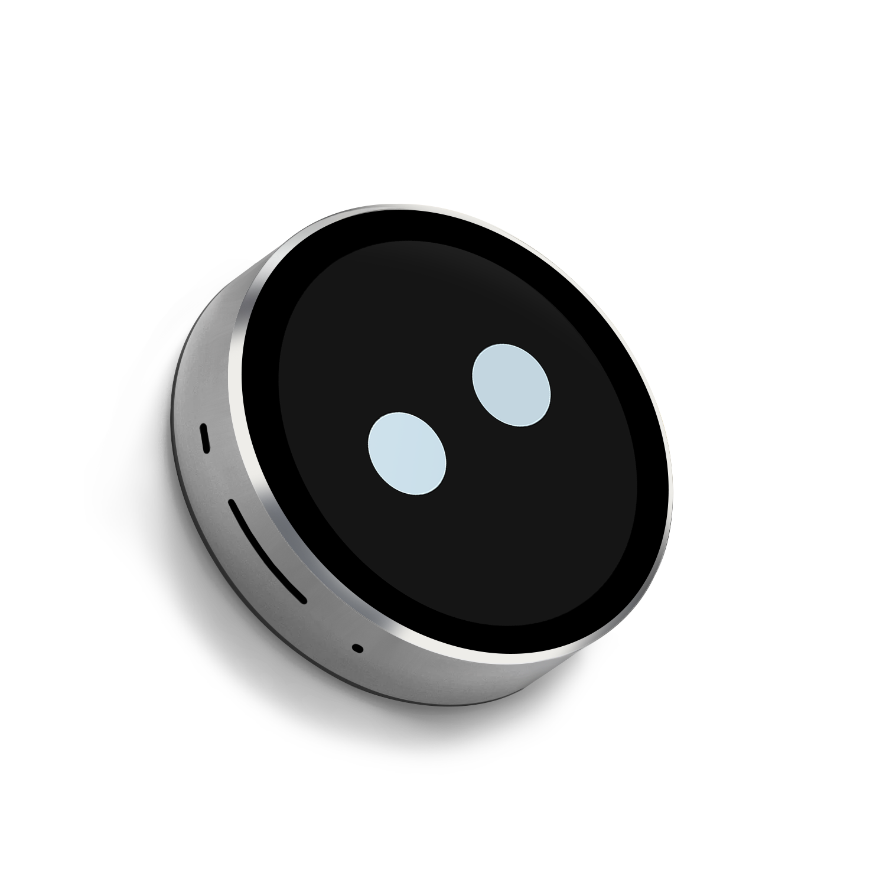
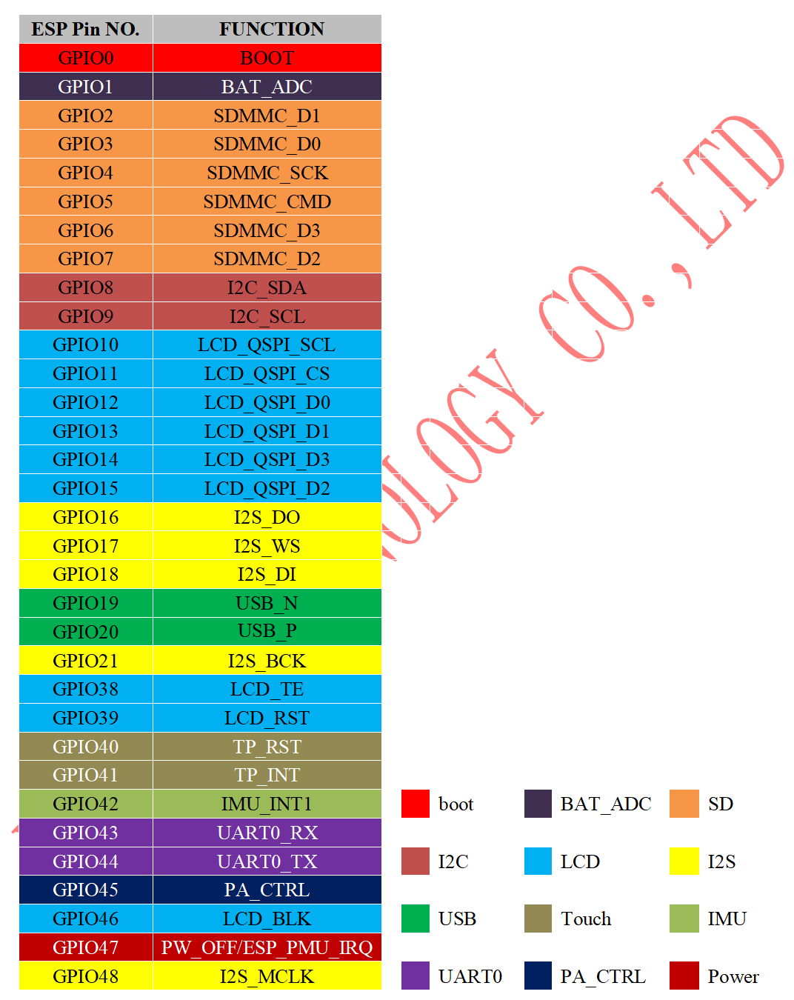
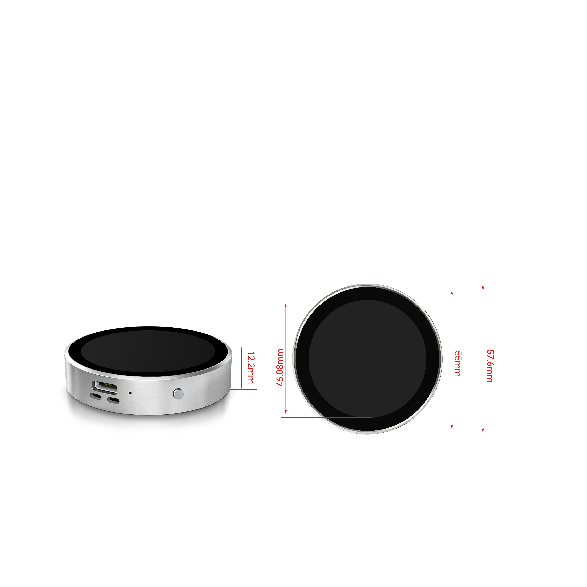

# SmartRing-Plus-SmartDisplay
[中文](/README_CN.md)

<div align="center">

<a href=" " target="_blank">
  
</a>
&nbsp;&nbsp;&nbsp;&nbsp;
<a href="mailto:smartrd1@viewedisplay.com">
  
</a>

</div>



## 1. Introduction
The SmartRing-Plus-SmartDisplay is a compact high-performance smart display module designed by VIEWE, featuring a 1.85-inch circular IPS touch screen. Built around the ESP32-S3-N16R8 dual-core MCU, it integrates Wi-Fi and Bluetooth BLE5.0 wireless connectivity, supporting a wealth of practical functions and flexible secondary development. With its exquisite CNC-machined casing, rich peripheral interfaces, and low-power design, it is suitable for a variety of embedded application scenarios requiring human-machine interaction, multimedia playback, and IoT connectivity.

### 1.1 Product Features
- Processor
  - Main control chip: ESP32-S3-N16R8 (dual-core MCU)
  - Main frequency: 240MHz
  - Wireless connectivity: 2.4GHz Wi-Fi, Bluetooth BLE5.0, BLE Mesh
  - Operating system: RTOS

- Memory
  - SRAM: 520KB
  - PSRAM: 8MB
  - ROM: 448KB
  - Flash: 16MB

- Display & Touch
  - Screen size: 1.85-inch (circular)
  - Resolution: 360×360 pixels
  - Display mode: IPS, transmissive, normally black
  - Touch type: Capacitive touch (TP IC: CST816S)
  - Brightness: 400 cd/m²
  - Color gamut: 70% (262K colors)
  - Contrast ratio: 1200:1
  - PPI: 200

- Core Functions
  - Computer secondary screen (AIDA64): 5 built-in styles
  - Audio spectrum pickup
  - High-quality MP3 playback (supports 320K decoding)
  - Digital photo frame (supports user-added photos)
  - MJPEG video playback
  - Balance ball game (gyroscope control)
  - Themed clock (adjustable time zone: international/China)
  - Wireless power supply (supports QI protocol)
  - Real-time weather (via Wi-Fi internet connection)
  - Continuous function upgrades

- Peripheral Interfaces & Modules
  - UART/USB interfaces
  - TF card slot (SDMMC)
  - I2S digital microphone (ZTS6216)
  - I2S digital-to-analog conversion (ES8311)
  - Power amplifier (NS4150B)
  - IMU sensor (QMI8658A)
  - Rechargeable battery (3.7V, 600mAh)
  - Speaker interface (8Ω / 1W)
  - QSPI interface (for display driver)

- Development Support
  - Supported IDEs: Arduino IDE, ESP IDE, MicroPython, PlatformIO
  - UI development: LVGL
  - Secondary development: Full support with provided source code
  - Xiaozhi integration: Source code available

- Hardware Specifications
  - Outline dimension: φ57.6mm (circular)
  - Thickness: 12.2mm
  - Shell color: Metallic black/Silver/Customizable
  - Casing process: CNC-machined
  - Power supply: DC 5V, 1A (supports wireless charging via QI protocol)

### 1.2 Applications
With its compact size, rich functions, and wireless connectivity, the SmartRing-Plus is ideal for IoT devices and embedded systems in the following fields:

- Desktop smart assistant (computer secondary screen)
- Personal multimedia player (music/photo/video)
- Home smart control panel
- IoT sensor data display terminal
- Portable entertainment device (built-in game)
- Customized themed clock/weather station
- Embedded HMI (Human-Machine Interface)
- Educational electronics
- Creative DIY projects

## 2. Hardware Description
### 2.1 Module Introduction

① ESP32-S3-N16R8 Main Control Chip：
Dual-core MCU with integrated Wi-Fi/BLE5.0, 8MB PSRAM, 16MB Flash

② 1.85-inch Circular Display：
IPS screen (360×360), capacitive touch (CST816S)

③ TF Card Slot：
Supports SDMMC protocol for storage expansion

④ I2S Audio Module：
Includes ES8311 DAC, NS4150B power amplifier, ZTS6216 microphone

⑤ IMU Sensor (QMI8658A)：
Gyroscope for motion detection (balance ball game)

⑥ Rechargeable Battery：
3.7V, 600mAh (supports wireless charging via QI)

⑦ USB Interface：
For power supply, program burning, and debugging

⑧ Reset Button：
Hardware reset function

⑨ BOOT Button：
Press when powering on/resetting to enter download mode

⑩ Wireless Charging Receiver：
Supports QI protocol for wireless power supply

### 2.2 GPIO Definition



### 2.3 Version Difference
The SmartRing-Plus series includes three versions, with the differences as follows:

| Product Version | Matching Screen Model | Core Difference |
|-----------------|-----------------------|-----------------|
| SmartRing-Plus-A | VIEWE UE018HV-RB39-A002A | Screen model and corresponding initialization parameters |
| SmartRing-Plus-B | VIEWE UE018HV-RB39-A004A | Screen model and corresponding initialization parameters |
| SmartRing-Plus-B V2 | VIEWE UE018HV-RB39-A004A | The power management chip is changed from ETA6002E8A to AXP2101 |

**Version Identification Methods**:
1. Product packaging: Clearly marked with version model (A/B/B V2)
2. Firmware suffix: _A for version A, _B for version B
3. Sample code: Version-specific codes provided for secondary development

> [!Note]
> No distinction shall be made between Version B V2 and B

## 3. Software

We provide comprehensive support for **Arduino**, **PlatformIO**, and **ESP-IDF** frameworks, with pre-ported **LVGL** examples.

### 3.1 Software Examples
Examples are available in the [GitHub Repository](examples).

| Framework | Example Path | Description |
| :--- | :--- | :--- |
| **Arduino** | `examples/arduino/gui/lvgl_v8` | **LVGL Benchmark**: Demonstrates 800x480 UI rendering. It can also be directly opened in the Arduino IDE. |
| **esp-idf** | `examples/esp_idf` | **lvgl port**: Example of porting and using lvgl in esp-idf |
| **esp-idf** | `examples/esp_idf/sd_card_spi` | **sd_card**: Examples of using an SD card on a device |
| **PlatformIO**| `examples/platformio/lvgl_v8_port` | **lvgl v8 port**: Usage example of lvgl v8. |

### 3.2 Getting Started

#### 3.2.1 Preparation
* **Hardware**: SmartRing-Plus Development Board (Version A/B), USB-C Cable.
* **Software**: VS Code (ESP-IDF v5.3+) or Arduino IDE (v2.0+) or VS Code (PlatformIO).
* **Library**: The following libraries are needed for Arduino IDE and PlatformIO

    |Libraries|version|Description|
    | :--- | :--- | :--- |
    |`ESP32_Display_Panel`| `1.0.3+` |by Espressif, This is necessary to drive the screen.|
    |`ESP32_IO_Expander`| `Arduino automatic selection` |The dependency library of `ESP32_Display_Panel` should be selected for installation together during the installation process.|
    |`esp-lib-utils`| `Arduino automatic selection` |The dependency library of `ESP32_Display_Panel` should be selected for installation together during the installation process.|
    |`lvgl`| `8.4.0` | A free and open-source embedded graphics library. |

#### 3.2.2  ESP-IDF Setup

Examples available for idf:
| Example | Description |
|------|------|
| [01_i2c_scan](examples/esp-idf/01_i2c_scan) | Scan shared I2C bus and list device addresses |
| [02_battery](examples/esp-idf/02_battery) | Display voltage, battery level and charging status |
| [03_wifi](examples/esp-idf/03_wifi) | STA network connection (SSID/password configured via menuconfig) |
| [04_lvgl_port](examples/esp-idf/04_lvgl_port) | LVGL porting, run official Widgets Demo |
| [05_sd](examples/esp-idf/05_sd) | Mount SD card, write and read back `hello.txt` |
| [06_music](examples/esp-idf/06_music) | Play MP3 files under `/Music` (previous track / pause / next track) |
| [07_recorder](examples/esp-idf/07_recorder) | Record 5-second WAV audio and playback |
| [08_album](examples/esp-idf/08_album) | Slideshow of images in `/Photos` or `/DCIM` |
| [09_imu](examples/esp-idf/09_imu) | IMU level gauge and calibration |
| [10_full-device](examples/esp-idf/10_full-device) | SmartRing-Plus full device demo: clock, weather, audio recording, music, IMU, photo album, settings |
| [11_xiaozhi](examples/esp-idf/11_xiaozhi) | AI Xiaozhi 2.0 example |

All these directories are **sibling folders** under `examples/esp-idf`.

Please **open one of the subdirectories** using VS Code / Cursor (where you can see the project's own `CMakeLists.txt`).
**Do not** open the root `examples/` directory itself, otherwise the IDF extension will fail to recognize the project correctly.

Recommended sequence: Run examples `01` to `09` first to get familiar with individual peripherals, then flash [10_full-device](examples/esp-idf/10_full-device) to view the complete interface.

Each example directory contains both `README.md` (English) and `README_CN.md` (Chinese). Follow the instructions after opening the project.

The general process is as follows:
1.  **Open platformio example**
    * go to GitHub to download the program. You can download the main branch by clicking on the "<> Code" with green text
    * Open the example using VS Code(ESP-IDF)
2.  **Compile and upload**:
    * Click `build` in the upper right corner to compile.
    * connect the microcontroller to the computer.If the compilation is correct.
    * Click `upload` in the upper right corner to download.

#### 3.2.3 Arduino Setup ([Novice tutorial](https://github.com/VIEWESMART/VIEWE-Tutorial/blob/main/Arduino%20Tutorial/Arduino%20Getting%20Started%20Tutorial.md))
1.  **Install[Arduino](https://www.arduino.cc/en/software)**
    - Choose installation based on your system type.
    - Newcomers please refer to the [beginner's tutorial](https://github.com/VIEWESMART/VIEWE-Tutorial/blob/main/Arduino%20Tutorial/Arduino%20Getting%20Started%20Tutorial.md).
2.  **Install ESP32 Board Package**:
    - Open Arduino IDE
    - Go to `File` > `Preferences`
    - Add to `Additional boards manager URLs`:
    ```
    https://espressif.github.io/arduino-esp32/package_esp32_index.json
    ```
    * Go to *Tools > Board > Boards Manager*.
    * Search `esp32` by Espressif and install version **3.0.0+**.
3.  **Install Libraries**:
    * Go to *Sketch > Include Library > Library Manager*.
    * Search `ESP32_Display_Panel` by Espressif and install version **1.0.3+**. You will be prompted whether to install its dependencies, please click **INSTALL ALL** to install all.
    * Install `lvgl` (v8.4.0 recommended).
4.  **Open example**:
    * Navigate to `File` > `Examples` > `ESP32_Display_Panel`
    * Select `Arduino` > `gui` > `lvgl_v8` > `simple_port`
5.  **Select Board**:
    * Target: `ESP32S3 Dev Module`.
    * Settings:
        * **Flash Size**: 16MB (128Mb)
        * **Partition Scheme**: 16M Flash (3MB APP/9.9MB FATFS)
        * **PSRAM**: **OPI PSRAM** (Crucial!)
6.  **config esp supported panel board**:
    * Open the `esp_panel_board_supported_conf.h` file in the example
    * Enable this file: change the `ESP_PANEL_BOARD_DEFAULT_USE_SUPPORTED` macro definition to `1`
    * ensure you uncomment: `#define BOARD_VIEWE_SMARTRING_PLUS_A` or `#define BOARD_VIEWE_SMARTRING_PLUS_B`
    ```c
    ...
    /**
    * @brief Flag to enable supported board configuration (0/1)
    *
    * Set to `1` to enable supported board configuration, `0` to disable
    */
    #define ESP_PANEL_BOARD_DEFAULT_USE_SUPPORTED       (1)
    ...
    // #define BOARD_VIEWE_SMARTRING
    // #define BOARD_VIEWE_SMARTRING_PLUS_A
    // #define BOARD_VIEWE_SMARTRING_PLUS_B
    // #define BOARD_VIEWE_UEDX24240013_MD50E
    // #define BOARD_VIEWE_UEDX24320024E_WB_A
    // #define BOARD_VIEWE_UEDX24320028E_WB_A
    // #define BOARD_VIEWE_UEDX24320035E_WB_A
    // #define BOARD_VIEWE_UEDX32480035E_WB_A
    // #define BOARD_VIEWE_UEDX46460015_MD50ET
    // #define BOARD_VIEWE_UEDX48270043E_WB_A
    // #define BOARD_VIEWE_UEDX48480021_MD80E_V2
    // #define BOARD_VIEWE_UEDX48480021_MD80E
    // #define BOARD_VIEWE_UEDX48480021_MD80ET
    // #define BOARD_VIEWE_UEDX48480028_MD80ET
    // #define BOARD_VIEWE_UEDX48480040E_WB_A
    // #define BOARD_VIEWE_UEDX80480043E_WB_A
    // #define BOARD_VIEWE_UEDX80480050E_AC_A
    // #define BOARD_VIEWE_UEDX80480050E_WB_A
    // #define BOARD_VIEWE_UEDX80480050E_WB_A_2
    // #define BOARD_VIEWE_UEDX80480070E_WB_A
    ...
    ```
7.  **Configure the example**:
    - [Optional] Edit the macro definitions in the `lvgl_v8_port.h` file
        - **If using `RGB/MIPI-DSI` interface**, change the `LVGL_PORT_AVOID_TEARING_MODE` macro definition to `1`/`2`/`3` to enable the avoid tearing function. After that, change the `LVGL_PORT_ROTATION_DEGREE` macro definition to the target rotation degree
        - **If using other interfaces**, please don't modify the `LVGL_PORT_AVOID_TEARING_MODE` and `LVGL_PORT_ROTATION_DEGREE` macro definitions
    - [Optional] Edit the macro definitions in the `lv_conf.h` file
        - **If using `SPI/QSPI` interface**, change the `LV_COLOR_16_SWAP` macro definition to `1`.
8.  **Select the correct port**:
    * Connect to the device.
    * Go to `Tools` > `Port`, Select the corresponding port.
9.  **Compile and upload**:
    * Click `√` in the upper right corner to compile.
    * connect the microcontroller to the computer.If the compilation is correct.
    * Click `→` in the upper right corner to download.


> [!TIP]
> **Configuration**: In `esp_panel_board_supported_conf.h`, ensure you uncomment:`#define BOARD_VIEWE_SMARTRING_PLUS_A` or `#define BOARD_VIEWE_SMARTRING_PLUS_B`
> The selection of the enabled development board is based on the version.
> Do not enable both `ESP_PANEL_BOARD_DEFAULT_USE_SUPPORTED` and `ESP_PANEL_BOARD_DEFAULT_USE_CUSTOM`
> You cannot enable multiple esp supported panel boards at the same time.

#### 3.2.4 PlatformIO Setup
1.  **Open platformio example**
    * go to GitHub to download the program. You can download the main branch by clicking on the "<> Code" with green text
    * Open the example using VS Code(PlatformIO)
2.  **Configure PlatformIO**:
    * This example uses the `BOARD_ESPRESSIF_ESP32_S3_LCD_EV_BOARD_2_V1_5` board as default. Choose `BOARD_VIEWE_SMARTRING_PLUS_A` or `BOARD_VIEWE_SMARTRING_PLUS_B` in the `[platformio]:default_envs` of the `platformio.ini` file.
3.  **Configure the example**:
    - [Optional] Edit the macro definitions in the `lvgl_v8_port.h` file
        - **If using `RGB/MIPI-DSI` interface**, change the `LVGL_PORT_AVOID_TEARING_MODE` macro definition to `1`/`2`/`3` to enable the avoid tearing function. After that, change the `LVGL_PORT_ROTATION_DEGREE` macro definition to the target rotation degree
        - **If using other interfaces**, please don't modify the `LVGL_PORT_AVOID_TEARING_MODE` and `LVGL_PORT_ROTATION_DEGREE` macro definitions
4.  **Compile and upload the project**
    - Click the `√`(Compile) button
    - Connect the board to your computer.If the compilation is correct.
    - Click the `→`(upload) button
---

## 6. Related Documents
- [SmartRing-Plus Specification (PDF)](datasheet/SmartRing%20Plus%20V2.0%20SPEC%20English.pdf)
- [ESP32-S3-N16R8 Datasheet (English)](datasheet/chip/datasheet_en.pdf)
- [ESP32-S3-N16R8 Datasheet (Chinese)](datasheet/chip/datasheet_cn.pdf)
- [Display Specification (SmartRing-Plus-A)](datasheet/display/SmartRing-Plus-A%20Display%20Specification.pdf)
- [Display Specification (SmartRing-Plus-B)](datasheet/display/SmartRing-Plus-B%20Display%20Specification.pdf)
- [Audio Chip (ES8311) Datasheet](datasheet/peripheral/ES8311_datasheet.pdf)
- [Power Amplifier (NS4150B) Datasheet](datasheet/peripheral/NS4150B_datasheet.pdf)
- [Microphone (ZTS6216) Datasheet](datasheet/peripheral/ZTS6216_datasheet.pdf)
- [IMU Sensor (QMI8658A) Datasheet](datasheet/peripheral/QMI8658A_datasheet.pdf)
- [All Datasheets](/datasheet)

## 7. Dimension Drawing

- Outline dimension: φ57.6mm (circular)
- Thickness: 12.2mm
- Display active area: 45.68(H)×45.68(V) mm
- Touch panel outline: 55(H)×55(V)×0.7(T) mm

## 8. Technical Support
- GitHub Repository: [https://github.com/VIEWESMART/SmartRing-Plus](https://github.com/VIEWESMART/SmartRing-Plus)
- Email: smartrd1@viewedisplay.com
- QQ Technical Exchange Group: 1014311090
- WhatsApp Business Account: [Contact via QR Code](image/Whatsapp.png)
- Documentation: [TAIJI VIEWE Pi](), [VIEWE Xiaozhi]()
