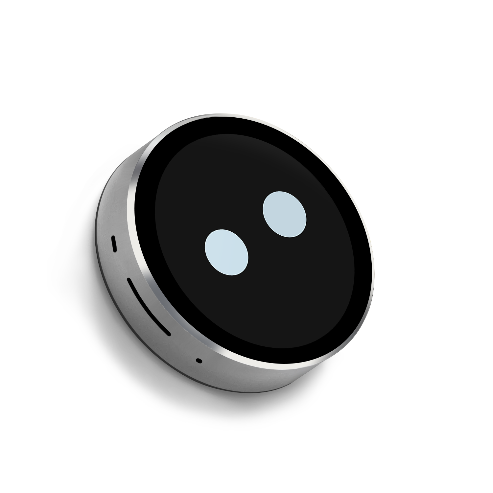

# SmartRing-Plus 智能圆形显示屏
[英文版](/README.md)

<div align="center">

<a href=" " target="_blank">
  
</a>
&nbsp;&nbsp;&nbsp;&nbsp;
<a href="mailto:smartrd1@viewedisplay.com">
  
</a>

</div>



## 一、产品介绍
SmartRing-Plus 智能圆形显示屏是微视显（VIEWE）设计的一款紧凑型高性能智能显示模组，搭载1.85英寸圆形IPS触摸屏幕，基于ESP32-S3-N16R8双核微控制器开发，集成Wi-Fi和蓝牙BLE5.0无线通信能力，支持丰富的实用功能与灵活的二次开发。产品采用精致的CNC精雕外壳，配备丰富的外设接口，兼具低功耗设计，适用于各类需要人机交互、多媒体播放及物联网连接的嵌入式应用场景。

### 1.1 产品核心特性
- **处理器**
  - 主控芯片：ESP32-S3-N16R8（双核微控制器）
  - 主频：240MHz
  - 无线通信：2.4GHz Wi-Fi、蓝牙BLE5.0、BLE Mesh
  - 操作系统：RTOS实时操作系统

- **存储配置**
  - 静态随机存储器（SRAM）：520KB
  - 伪静态随机存储器（PSRAM）：8MB
  - 只读存储器（ROM）：448KB
  - 闪存（Flash）：16MB

- **显示与触摸**
  - 屏幕尺寸：1.85英寸（圆形）
  - 分辨率：360×360 像素
  - 显示模式：IPS屏、透射式、常黑型
  - 触摸类型：电容式触摸（触摸芯片：CST816S）
  - 亮度：400 坎德拉/平方米（cd/m²）
  - 色域：70%（262K色）
  - 对比度：1200:1
  - 像素密度（PPI）：200

- **核心功能**
  - 电脑副屏（AIDA64）：内置5种显示样式
  - 音频频谱采集
  - 高品质MP3播放（支持320K码率解码）
  - 数字相框（支持用户自定义添加图片）
  - MJPEG格式视频播放
  - 平衡球游戏（陀螺仪操控）
  - 主题时钟（时区可调：国际/中国）
  - 无线供电（支持QI无线充电协议）
  - 实时天气（通过Wi-Fi联网获取）
  - 功能持续迭代升级

- **外设接口与模组**
  - UART/USB 双接口
  - TF卡卡槽（支持SDMMC协议）
  - I2S数字麦克风（ZTS6216）
  - I2S数模转换芯片（ES8311）
  - 功率放大器（NS4150B）
  - 惯性测量传感器（IMU：QMI8658A）
  - 可充电锂电池（3.7V，600mAh）
  - 扬声器接口（8Ω / 1W）
  - QSPI接口（显示屏驱动专用）

- **开发支持**
  - 兼容开发环境：Arduino IDE、ESP IDE、MicroPython、PlatformIO
  - 界面开发：LVGL图形库
  - 二次开发：提供完整源码，全流程支持
  - 小智集成：配套开源集成源码

- **硬件规格**
  - 外形尺寸：φ57.6mm（圆形）
  - 厚度：12.2mm
  - 外壳颜色：金属黑/银色/支持定制
  - 外壳工艺：CNC精雕加工
  - 供电方式：直流5V 1A（支持QI协议无线充电）

### 1.2 适用场景
本产品体积小巧、功能丰富且支持无线通信，是物联网设备与嵌入式系统的理想选择，适用于以下领域：
- 桌面智能助手（电脑副屏）
- 电子书
- 个人多媒体播放器（音乐/图片/视频）
- 物联网传感器数据显示终端
- 便携式娱乐设备（内置游戏）
- 定制化主题时钟/气象站
- 嵌入式人机交互界面（HMI）
- 教育电子设备
- 创意DIY项目

## 二、硬件说明
### 2.1 模组部件介绍
① ESP32-S3-N16R8 主控芯片：
双核微控制器，集成Wi-Fi/BLE5.0，搭载8MB PSRAM、16MB Flash
② 1.85英寸圆形显示屏：
IPS屏（360×360分辨率），搭配CST816S电容触摸芯片
③ TF卡卡槽：
支持SDMMC协议，实现存储容量扩展
④ I2S音频模组：
集成ES8311数模转换芯片、NS4150B功率放大器、ZTS6216麦克风
⑤ 惯性测量传感器（QMI8658A）：
内置陀螺仪，实现运动检测（平衡球游戏操控）
⑥ 可充电锂电池：
3.7V 600mAh（支持QI协议无线充电）
⑦ USB接口：
用于供电、程序烧录及调试
⑧ 复位按键：
硬件系统复位功能
⑨ BOOT按键：
上电/复位时按下，进入程序下载模式
⑩ 无线充电接收端：
支持QI协议，实现无线供电

### 2.2 GPIO引脚定义
| ESP引脚号 | 功能说明 |
|-----------|----------|
| GPIO0     | 下载模式/电源相关 |
| GPIO1     | 电池检测ADC |
| GPIO2     | SDMMC数据1 |
| GPIO3     | SDMMC数据0 |
| GPIO4     | SDMMC时钟 |
| GPIO5     | SDMMC命令 |
| GPIO6     | SDMMC数据3 |
| GPIO7     | SDMMC数据2 |
| GPIO8     | 触摸I2C数据 |
| GPIO9     | 触摸I2C时钟 |
| GPIO10    | 显示屏QSPI时钟 |
| GPIO11    | 显示屏QSPI片选 |
| GPIO12    | 显示屏QSPI数据0 |
| GPIO13    | 显示屏QSPI数据1 |
| GPIO14    | 显示屏QSPI数据3 |
| GPIO15    | 显示屏QSPI数据2 |
| GPIO16    | I2S数据输出 |
| GPIO17    | I2S帧同步 |
| GPIO18    | I2S数据输入 |
| GPIO19    | USB负极 |
| GPIO20    | USB正极 |
| GPIO21    | I2S位时钟 |
| GPIO38    | 显示屏同步信号 |
| GPIO39    | 显示屏复位 |
| GPIO40    | 触摸I2C时钟 |
| GPIO41    | 触摸中断 |
| GPIO42    | 惯性传感器中断1 |
| GPIO43    | 串口0接收 |
| GPIO44    | 串口0发送 |
| GPIO45    | 无 |
| GPIO46    | 触摸背光 |
| GPIO47    | 电源关闭 |
| GPIO48    | I2S主时钟 |

### 2.3 版本差异
SmartRing-Plus系列包含两个版本，除屏幕型号及对应初始化参数外，其余硬件规格完全一致：

| 产品版本 | 适配屏幕型号 | 核心差异 |
|-----------------|-----------------------|----------|
| SmartRing-Plus-A | VIEWE UE018HV-RB39-A002A | 屏幕型号及对应的初始化参数 |
| SmartRing-Plus-B | VIEWE UE018HV-RB39-A004A | 屏幕型号及对应的初始化参数 |

**版本识别方法**：
1. 产品包装：外包装明确标注版本型号（A/B）
2. 固件后缀：版本A固件后缀为_A，版本B固件后缀为_B
3. 示例代码：二次开发配套分版本专属示例代码

## 三、软件支持
本产品全面支持**Arduino**、**PlatformIO**、**ESP-IDF** 开发框架，已完成**LVGL**图形库的移植并提供配套示例工程。

### 3.1 软件示例工程
示例工程均存放于[GitHub代码仓库](examples)，各框架对应工程如下：

| 开发框架 | 示例工程路径 | 功能说明 |
| :--- | :--- | :--- |
| **Arduino** | `examples/arduino/gui/lvgl_v8` | **LVGL性能测试**：演示360×360分辨率界面渲染，可直接在Arduino IDE中打开 |
| **esp-idf** | `examples/esp_idf/lvgl_port` | **LVGL移植**：ESP-IDF框架下LVGL图形库的移植与使用示例 |
| **esp-idf** | `examples/esp_idf/sd_card_spi` | **SD卡使用**：设备端TF卡的操作示例 |
| **PlatformIO**| `examples/platformio/lvgl_v8_port` | **LVGL v8移植**：PlatformIO框架下LVGL v8的使用示例 |

### 3.2 快速上手
#### 3.2.1 准备工作
* **硬件**：SmartRing-Plus开发板（A/B版本）、USB-C数据线
* **软件**：VS Code（搭配ESP-IDF v5.3+）、Arduino IDE（v2.0+）、VS Code（搭配PlatformIO）
* **库文件**：Arduino IDE和PlatformIO需安装以下库文件，版本要求如下：

| 库文件名称 | 版本要求 | 功能说明 |
| :--- | :--- | :--- |
|`ESP32_Display_Panel`| `1.0.3+` | 乐鑫官方库，显示屏驱动必备 |
|`ESP32_IO_Expander`| `Arduino自动匹配` | `ESP32_Display_Panel`的依赖库，安装时需一并选择 |
|`esp-lib-utils`| `Arduino自动匹配` | `ESP32_Display_Panel`的依赖库，安装时需一并选择 |
|`lvgl`| `8.4.0` | 开源嵌入式图形库 |

#### 3.2.2  ESP-IDF 环境搭建
1.  **打开示例工程**
    * 前往GitHub下载工程代码，点击绿色的`<> Code`按钮下载主分支
    * 使用搭载ESP-IDF插件的VS Code打开示例工程
2.  **编译与烧录**
    * 点击右底部`build`按钮进行代码编译
    * 将开发板连接至电脑，选择端口
    * 编译通过后，点击底部`upload`按钮完成固件烧录

#### 3.2.3 Arduino 环境搭建（[新手教程](https://github.com/VIEWESMART/VIEWE-Tutorial/blob/main/Arduino%20Tutorial/Arduino%20Getting%20Started%20Tutorial.md)）
1.  **安装Arduino IDE**
    - 根据操作系统选择对应版本安装
    - 新手建议参考上述[新手教程](https://github.com/VIEWESMART/VIEWE-Tutorial/blob/main/Arduino%20Tutorial/Arduino%20Getting%20Started%20Tutorial.md)完成基础配置
2.  **安装ESP32开发板包**
    - 打开Arduino IDE，进入`文件` > `首选项`
    - 在「附加开发板管理器网址」中添加以下地址：
    ```
    https://espressif.github.io/arduino-esp32/package_esp32_index.json
    ```
    * 进入`工具` > `开发板` > `开发板管理器`，搜索乐鑫官方的`esp32`，安装**3.0.0+**版本
3.  **安装库文件**
    * 进入 `项目` > `导入库` > `库管理器`
    * 搜索乐鑫官方的`ESP32_Display_Panel`，安装**1.0.3+**版本，安装时会提示安装依赖库，点击**INSTALL ALL**一键安装
    * 搜索并安装`lvgl`库，推荐版本**8.4.0**
4.  **打开示例工程**
    * 进入`文件` > `示例` > `ESP32_Display_Panel`
    * 依次选择`Arduino` > `gui` > `lvgl_v8` > `simple_port`
5.  **选择开发板并配置参数**
    * 目标开发板：`ESP32S3 Dev Module`
    * 关键参数设置：
        * 闪存大小（Flash Size）：16MB (128Mb)
        * 分区方案（Partition Scheme）：16M Flash (3MB APP/9.9MB FATFS)
        * 伪静态随机存储器（PSRAM）：**OPI PSRAM**（此项为关键配置，必须正确选择）
6.  **配置模组型号宏定义**
    * 打开示例工程中的`esp_panel_board_supported_conf.h`文件
    * 启用该配置文件：将宏定义`ESP_PANEL_BOARD_DEFAULT_USE_SUPPORTED`修改为`1`
    * 根据开发板版本，取消对应宏定义的注释：`#define BOARD_VIEWE_SMARTRING_PLUS_A` 或 `#define BOARD_VIEWE_SMARTRING_PLUS_B`
    ```c
    ...
    /**
    * @brief 启用已支持的开发板配置标志（0/1）
    *
    * 设置为1启用，设置为0禁用
    */
    #define ESP_PANEL_BOARD_DEFAULT_USE_SUPPORTED       (1)
    ...
    // #define BOARD_VIEWE_SMARTRING
    // #define BOARD_VIEWE_SMARTRING_PLUS_A
    // #define BOARD_VIEWE_SMARTRING_PLUS_B
    // #define BOARD_VIEWE_UEDX24240013_MD50E
    // #define BOARD_VIEWE_UEDX24320024E_WB_A
    // #define BOARD_VIEWE_UEDX24320028E_WB_A
    // #define BOARD_VIEWE_UEDX24320035E_WB_A
    // #define BOARD_VIEWE_UEDX32480035E_WB_A
    // #define BOARD_VIEWE_UEDX46460015_MD50ET
    // #define BOARD_VIEWE_UEDX48270043E_WB_A
    // #define BOARD_VIEWE_UEDX48480021_MD80E_V2
    // #define BOARD_VIEWE_UEDX48480021_MD80E
    // #define BOARD_VIEWE_UEDX48480021_MD80ET
    // #define BOARD_VIEWE_UEDX48480028_MD80ET
    // #define BOARD_VIEWE_UEDX48480040E_WB_A
    // #define BOARD_VIEWE_UEDX80480043E_WB_A
    // #define BOARD_VIEWE_UEDX80480050E_AC_A
    // #define BOARD_VIEWE_UEDX80480050E_WB_A
    // #define BOARD_VIEWE_UEDX80480050E_WB_A_2
    // #define BOARD_VIEWE_UEDX80480070E_WB_A
    ...
    ```
7.  **示例工程个性化配置（可选）**
    - 编辑`lvgl_v8_port.h`文件中的宏定义：
        - **若使用RGB/MIPI-DSI接口**，将`LVGL_PORT_AVOID_TEARING_MODE`修改为`1`/`2`/`3`启用防撕裂功能，再将`LVGL_PORT_ROTATION_DEGREE`修改为目标屏幕旋转角度
        - **若使用其他接口**，请勿修改上述两个宏定义
    - 编辑`lv_conf.h`文件中的宏定义：
        - **若使用SPI/QSPI接口**，将`LV_COLOR_16_SWAP`修改为`1`
8.  **选择串口端口**
    * 将开发板连接至电脑，等待电脑识别串口
    * 进入`工具`>`端口`，选择开发板对应的串口
9.  **编译与烧录**
    * 点击右上角`√`按钮进行代码编译
    * 编译通过后，点击右上角`→`按钮完成固件烧录

> **提示**
> 1. 配置关键：在`esp_panel_board_supported_conf.h`中，务必根据开发板实际版本，取消`#define BOARD_VIEWE_SMARTRING_PLUS_A`或`#define BOARD_VIEWE_SMARTRING_PLUS_B`的注释
> 2. 互斥配置：不可同时启用`ESP_PANEL_BOARD_DEFAULT_USE_SUPPORTED`和`ESP_PANEL_BOARD_DEFAULT_USE_CUSTOM`
> 3. 单一配置：不可同时启用多个已支持的模组型号宏定义

#### 3.2.4 PlatformIO 环境搭建
1.  **打开示例工程**
    * 前往GitHub下载工程代码，点击绿色的`<> Code`按钮下载主分支
    * 使用搭载PlatformIO插件的VS Code打开示例工程
2.  **配置PlatformIO工程环境**
    * 示例工程默认使用`BOARD_ESPRESSIF_ESP32_S3_LCD_EV_BOARD_2_V1_5`开发板，需在`platformio.ini`文件的`[platformio]:default_envs`中，修改为`BOARD_VIEWE_SMARTRING_PLUS_A`或`BOARD_VIEWE_SMARTRING_PLUS_B`（与开发板版本匹配）
3.  **示例工程个性化配置（可选）**
    - 编辑`lvgl_v8_port.h`文件中的宏定义：
        - **若使用RGB/MIPI-DSI接口**，将`LVGL_PORT_AVOID_TEARING_MODE`修改为`1`/`2`/`3`启用防撕裂功能，再将`LVGL_PORT_ROTATION_DEGREE`修改为目标屏幕旋转角度
        - **若使用其他接口**，请勿修改上述两个宏定义
4.  **编译与烧录**
    - 点击左侧栏`√`（编译）按钮进行代码编译
    - 将开发板连接至电脑，编译通过后，点击左侧栏`→`（烧录）按钮完成固件烧录
---

## 六、相关文档
- [SmartRing-Plus 产品规格书(PDF)](datasheet/SmartRing-Plus-SPEC-V1.1.pdf)
- [ESP32-S3-N16R8 芯片规格书(英文)](datasheet/chip/datasheet_en.pdf)
- [ESP32-S3-N16R8 芯片规格书(中文)](datasheet/chip/datasheet_cn.pdf)
- [显示屏规格书(SmartRing-Plus-A)](datasheet/display/SmartRing-Plus-A%20Display%20Specification.pdf)
- [显示屏规格书(SmartRing-Plus-B)](datasheet/display/SmartRing-Plus-B%20Display%20Specification.pdf)
- [音频芯片(ES8311)规格书](datasheet/peripheral/ES8311_datasheet.pdf)
- [功率放大器(NS4150B)规格书](datasheet/peripheral/NS4150B_datasheet.pdf)
- [数字麦克风(ZTS6216)规格书](datasheet/peripheral/ZTS6216_datasheet.pdf)
- [惯性传感器(QMI8658A)规格书](datasheet/peripheral/QMI8658A_datasheet.pdf)
- [所有规格书汇总](/datasheet)

## 七、尺寸图纸

- 外形尺寸：φ57.6mm（圆形）
- 厚度：12.2mm
- 显示有效区域：45.68(宽)×45.68(高) mm
- 触摸面板尺寸：55(宽)×55(高)×0.7(厚) mm

## 八、技术支持
- GitHub代码仓库：[https://github.com/VIEWESMART/SmartRing-Plus](https://github.com/VIEWESMART/SmartRing-Plus)
- 官方邮箱：smartrd1@viewedisplay.com
- QQ技术交流群：1014311090
- WhatsApp商务账号：[扫码联系](image/Whatsapp.png)
- 配套文档：[太极优派](), [优奕小智]()

我可以帮你把这份中文版文档**优化GitHub格式**，比如调整图片路径、修正链接标注、优化代码块显示，需要吗？
